# Indexing Pipeline

How code goes from files on disk to a searchable index.

**Reading time:** 8 minutes
**Audience:** Users who want to understand how indexing works
**Prerequisites:** None (but [Tree-sitter Overview](tree-sitter/overview.md) helps)

---

## Quick Summary

- **Scanning** discovers files (respects .gitignore)
- **Parsing** extracts code structure (tree-sitter)
- **Chunking** creates searchable units (functions, types)
- **Embedding** converts chunks to vectors (Ollama/MLX)
- **Storing** saves to BM25 + HNSW indexes
- **Graph build** writes local file, symbol, import, config, and doc-reference edges

---

## The Big Picture

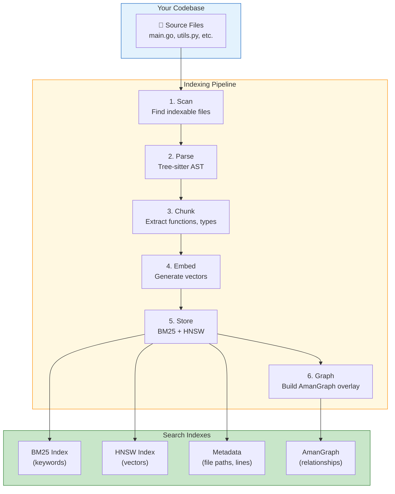

---

## Stage 1: File Scanning

### What Happens

The scanner walks your project directory, finding files to index.

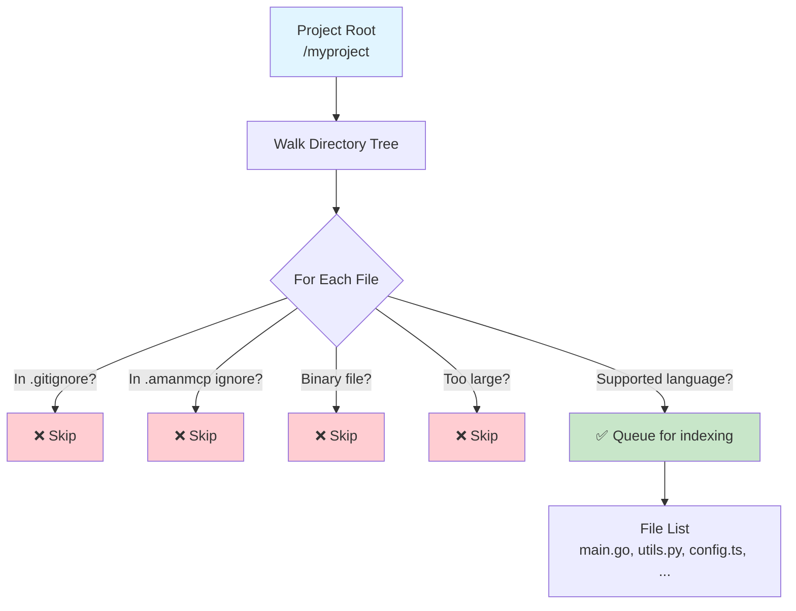

### Exclusion Rules

Files are excluded based on:

| Rule | Source | Example |
|------|--------|---------|
| Git ignores | `.gitignore` | `node_modules/`, `*.log` |
| AmanMCP config | `.amanmcp.yaml` | Custom patterns |
| Binary detection | Content inspection | Images, compiled files |
| Size limits | Default 1MB | Very large files |
| Hidden files | Convention | `.git/`, `.env` |

### Default Exclusions

```yaml
# Always excluded
- .git/
- node_modules/
- vendor/
- __pycache__/
- *.exe, *.dll, *.so
- *.jpg, *.png, *.gif
- *.zip, *.tar.gz
```

---

## Stage 2: Parsing

### What Happens

Each file is parsed into a syntax tree using tree-sitter.

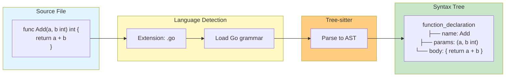

### Language Support

| Language | Extensions | Parser |
|----------|------------|--------|
| Go | `.go` | tree-sitter-go |
| Python | `.py` | tree-sitter-python |
| TypeScript | `.ts`, `.tsx` | tree-sitter-typescript |
| JavaScript | `.js`, `.jsx` | tree-sitter-javascript |
| Rust | `.rs` | tree-sitter-rust |
| Java | `.java` | tree-sitter-java |
| Markdown | `.md` | tree-sitter-markdown |
| PDF | `.pdf` | text extraction with `ledongthuc/pdf` |

Unsupported files fall back to line-based chunking.

### Content Support Tiers

| Tier | Content | Chunking Strategy | Result Metadata |
|------|---------|-------------------|-----------------|
| Tier 1 | Code | Parser-backed AST chunks for functions, types, methods, and related semantic units | Symbols, line ranges, parser-backed content type |
| Tier 2 | Markdown | Heading-aware and paragraph-aware document chunks with frontmatter lifted into metadata | Heading path, section title, `fm.<key>` frontmatter fields |
| Tier 2 | PDF | Page-aware text chunks extracted from in-memory PDF bytes | `content_type: "pdf"`, `chunker: "pdf"`, `page_number`, `page_start`, `page_end` |

PDF support is text-extraction only. OCR, scanned/image-only PDFs, encrypted
PDFs, form fields, and table-structure reconstruction are out of scope; when a
PDF produces no extractable text, indexing records a warning and does not create
empty search chunks for that file.

---

## Stage 3: Chunking

### What Happens

The syntax tree is walked to extract meaningful code units.

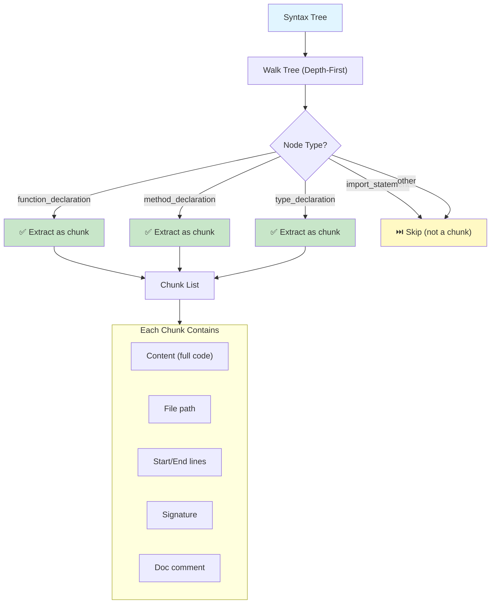

### What Gets Chunked

| Language | Chunk Types |
|----------|-------------|
| **Go** | Functions, methods, types, constants |
| **Python** | Functions, classes, methods |
| **TypeScript** | Functions, classes, interfaces, types |
| **Rust** | Functions, impls, structs, enums, traits |

### Chunk Size Considerations

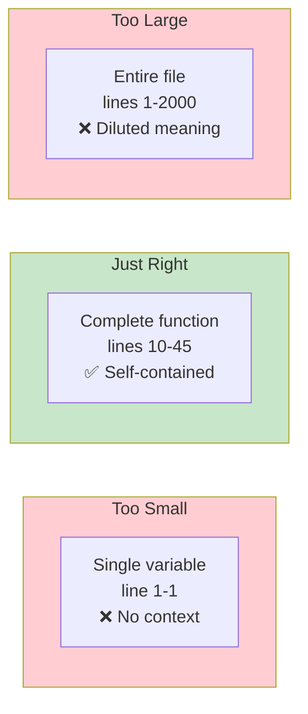

AmanMCP targets **complete semantic units** - whole functions, not fragments.

---

## Stage 4: Embedding

### What Happens

Each chunk is converted to a numerical vector that captures its meaning.

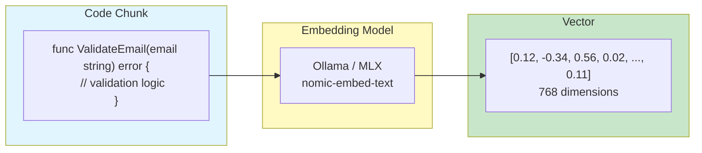

### Embedding Providers

| Provider | Model | Speed | Use Case |
|----------|-------|-------|----------|
| **Ollama** | nomic-embed-text | Fast | Default, cross-platform |
| **MLX** | nomic-embed-text | Faster | Apple Silicon optimization |
| **Static** | Word vectors | Instant | Offline fallback |

### Batching for Efficiency

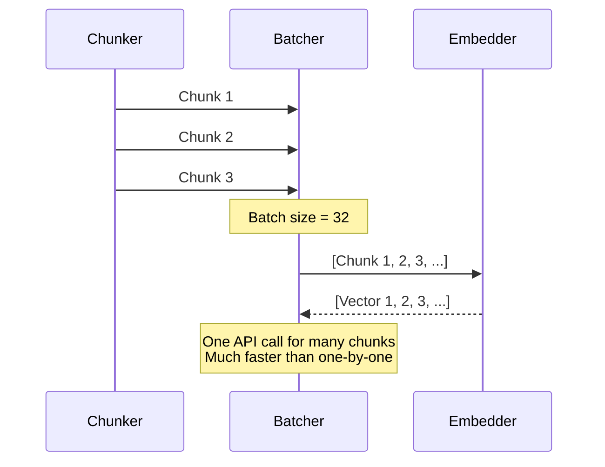

---

## Stage 5: Storage

### What Happens

Chunks and their vectors are stored in multiple indexes.

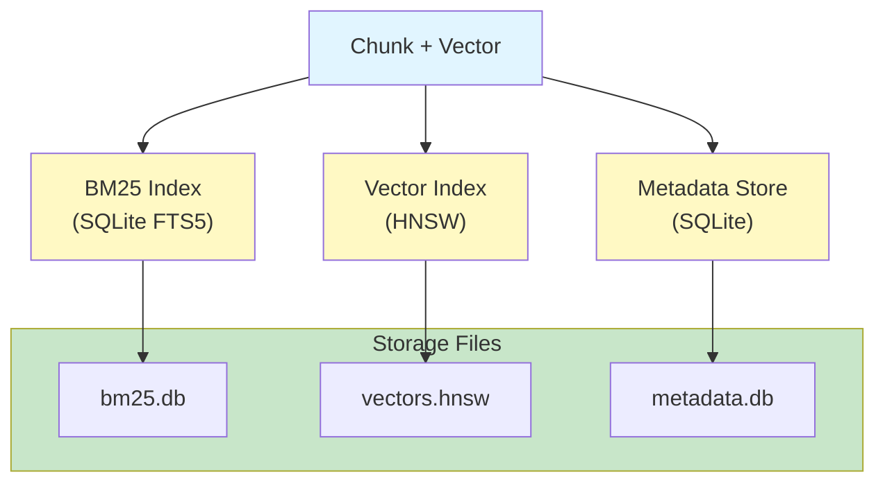

### What's Stored Where

| Store | Contents | Purpose |
|-------|----------|---------|
| **BM25** | Chunk text, tokenized | Keyword search |
| **HNSW** | Embedding vectors | Semantic search |
| **Metadata** | File paths, line numbers, signatures | Result display |

### Index Location

```
.amanmcp/
├── bm25.db         # SQLite FTS5 index
├── vectors.hnsw    # HNSW vector index
├── metadata.db     # Chunk metadata
├── graph.db        # AmanGraph relationship overlay
└── config.yaml     # Index configuration
```

---

## Stage 6: Graph Build

### What Happens

After search metadata, embeddings, BM25, and vector artifacts are committed, the
indexer converts scanned files and chunk symbols into the local AmanGraph
relationship overlay stored at `.amanmcp/graph.db`.

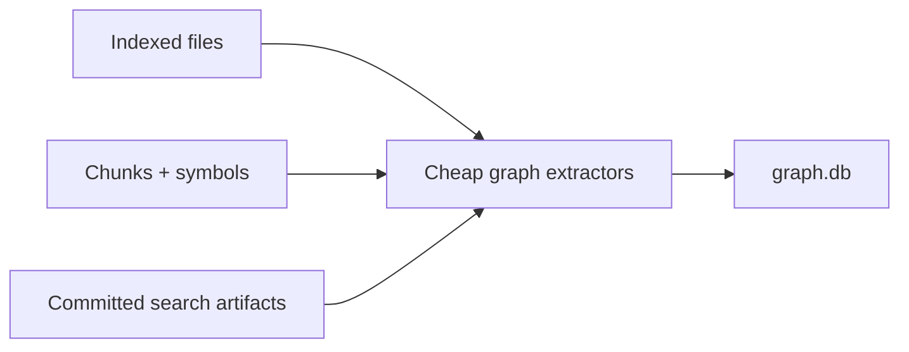

The default graph build records deterministic local relationships such as
projects containing files, files declaring packages, files importing modules,
files defining symbols, symbols belonging to chunks, config files defining
config keys, conservative test-to-implementation matches, and Markdown
references to known files, symbols, or config keys. User-visible graph queries
exclude stale edges by default; stale edge counts remain visible through the
read-only `amanmcp://graph_status` MCP resource. Graph freshness defaults to 24
hours, and stale-edge purge retention defaults to 7 days; both are named graph
defaults rather than hidden per-call magic numbers. The status resource exposes
the last full rebuild separately from the last incremental watcher update so
operators can tell whether a fresh graph came from a complete rebuild or a
single-file change. Use `amanmcp index --skip-graph` for a search-only index
run that leaves existing graph state untouched, or `amanmcp index --graph-only`
to rebuild the graph from an existing index without re-embedding.

---

## Complete Flow Diagram

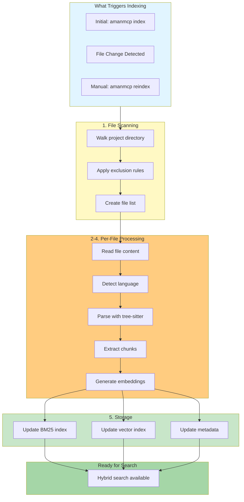

---

## Incremental Indexing

When files change, only affected parts are re-indexed:

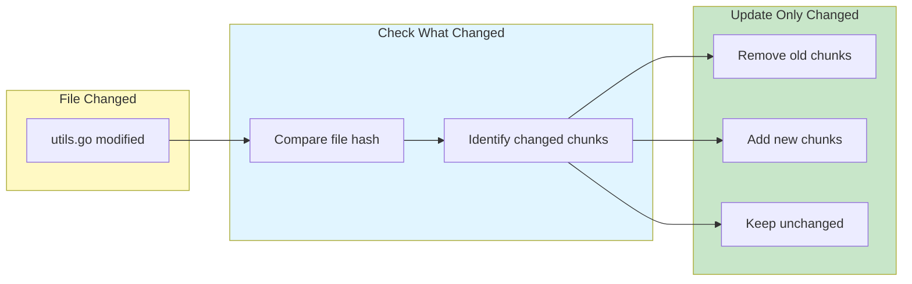

**Benefits:**
- Fast updates (seconds, not minutes)
- No need to re-embed unchanged code
- Maintains index consistency

---

## Performance Characteristics

| Stage | Typical Time | Bottleneck |
|-------|--------------|------------|
| Scanning | ~100ms for 10K files | Disk I/O |
| Parsing | ~5ms per file | CPU |
| Chunking | ~1ms per file | CPU |
| Embedding | ~20ms per chunk | GPU/CPU |
| Storage | ~1ms per chunk | Disk I/O |
| Graph build | ~1ms per indexed source | CPU + SQLite |

**Embedding is the slowest stage** - this is why batching and caching matter.

### Typical Index Times

| Codebase Size | Files | Chunks | Index Time |
|---------------|-------|--------|------------|
| Small (10K LOC) | 50 | 200 | ~10 seconds |
| Medium (100K LOC) | 500 | 2,000 | ~2 minutes |
| Large (1M LOC) | 5,000 | 20,000 | ~20 minutes |

---

## Monitoring Indexing

### Check Status

```bash
# View index status
amanmcp status

# Output:
# Indexed files: 1,234
# Total chunks: 5,678
# Index size: 45 MB
# Last indexed: 2 minutes ago
```

### Watch Progress

```bash
# Index with progress
amanmcp index --verbose

# Output:
# Scanning... 1,234 files found
# Parsing... 500/1,234 (40%)
# Graph... relationship overlay built
# Embedding... 2,500/5,678 chunks (44%)
# Storing... done
# Index complete in 2m 15s
```

---

## Next Steps

| Want to... | Read |
|------------|------|
| Understand tree-sitter parsing | [Tree-sitter Overview](tree-sitter/overview.md) |
| Learn how search uses the index | [Hybrid Search](hybrid-search/) |
| See caching strategies | [Caching & Performance](caching-performance.md) |
| Configure exclusions | [Configuration Guide](../reference/configuration.md) |

---

*The indexing pipeline transforms your codebase into a searchable knowledge base. Good indexing enables good search.*
